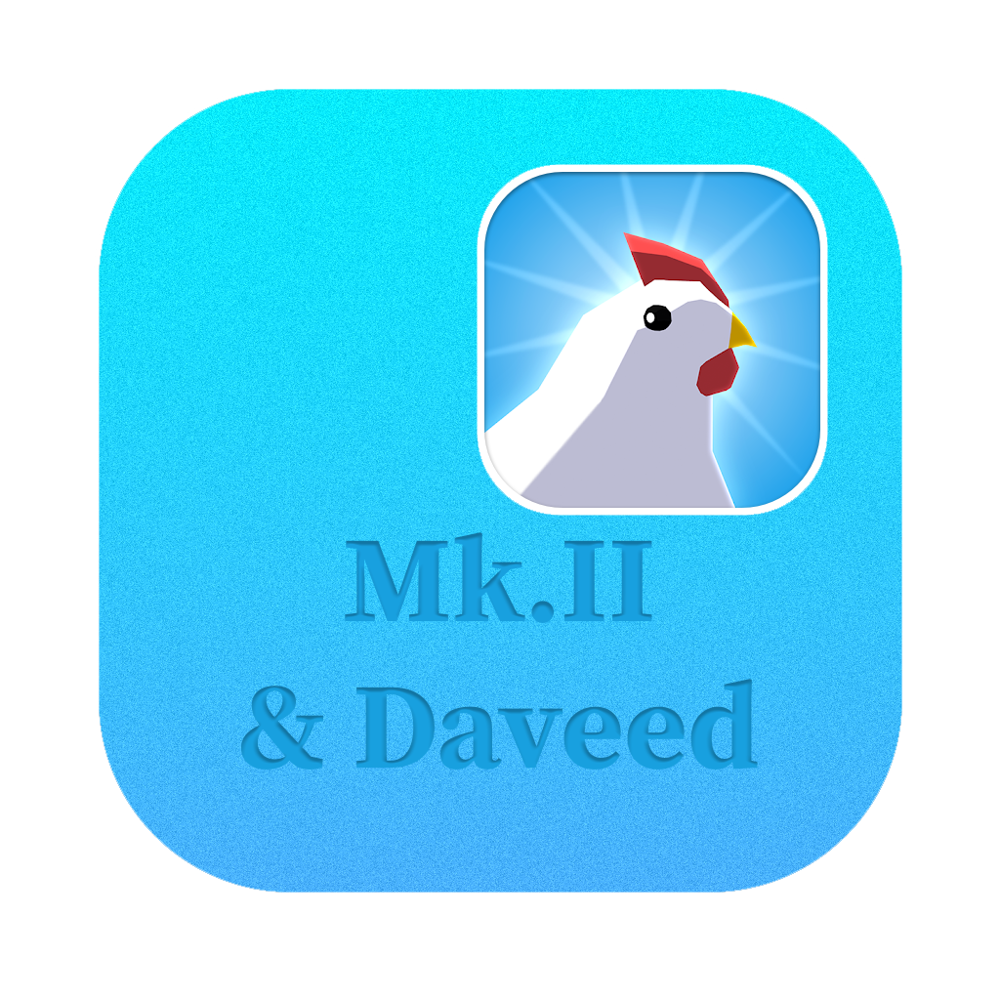

### I no longer have interest in maintaining this project. If anyone would like to take it up, feel free.

<h1 align="center">
  
</h1>

  
  

**EggLedger** helps export your Egg, Inc. spaceship mission data, including loot from each mission, to .xlsx (Excel) and .csv formats for further analysis. It is an extension to the [rockets tracker](https://wasmegg-carpet.netlify.app/rockets-tracker/), answering questions like "from which mission did I obtain this legendary artifact?" and "how many of this item dropped from my ships?" which can't be answered there due to technical or UI limitations.

[**Download now**](https://github.com/DavidArthurCole/EggLedger/releases).

## FAQ

**Windows Defender is blocking the download. What do I do?**

Windows has declared war on EggLedger, and more generally [GO-based executables](https://www.reddit.com/r/golang/comments/s1bh01/goexecutables_and_windows_defender/).

I cannot fix Microsoft false-flagging my app as malware, or solve this issue at all without paying thousands of dollars a year for a signing key. I do my best to use non-obfuscated code, and follow best-practices, however Windows' heuristic detection will be biased towards golang until Microsoft decides to do something about it.

If your Microsoft Defender is removing the file post-download, mark your `Ledger` folder (wherever you run `EggLedger.exe` from) as excluded from scans. `Windows Security` → `Virus & threat protection settings` → `Manage settings` → `Exclusions` → `Add or remove exclusions`. You can then specify your browser to download to that location (right click the link > `Save link as...`), over-write the old `.exe` file, and the new file should not be touched by Defender.

**Why is EggLedger asking me to install Chrome?**

EggLedger was originally built by MK2 on top of a `lorca`, an open-source solution to building Go apps with a web UI. `lorca` uses the Chromium API as its browser engine, and the default behavior when no chromium browser is detected, is to prompt you to install Google Chrome, as this is by far the most popular choice. I have since forked [my own version](https://github.com/DavidArthurCole/lorca) of `lorca`, and have added support for the following browsers, which will be detected and used, before you are prompted to install Chrome:
  - Brave
  - Opera
  - Vivaldi
  - Edge

If you use a **Chromium-based** browser that is not on the above list, please reach out, and I'll see what I can do about adding support (the benefit of having my own fork of lorca, now).
If EggLedger is launching in the incorrect browser, or you would prefer it launch in another browser, go to `Settings` in-app, and you can choose from a list of detected browsers.

**Can I run EggLedger on Mobile?**

Short answer, no. Long answer, if you're able to emulate a linux environment on your phone, or you are one of the few people with a Windows Phone™, you can try to run the app. However, the app was designed, and styled for desktop use, and may not work as expected on mobile. Beyond emulating a desktop environment, there is no support for mobile devices. The process for porting what is ostensibly a web server to a mobile app is not trivial, and beyond this, the developer licenses and upfront cost of deploying to Google Play and or the App Store are not worth the effort for a free, open-source project.

**Why does it take so long to load my data?**

Ledger needs to pull every ship you've ever sent into your local database, and then process that data to generate the ledger. This can take a while, especially if you have a lot of ships. The app will show a loading screen while it's working, and you can check the progress in-window. Each ship is a separate request to the Egg, Inc. API, and due to not wanting to overload the servers, or raise any flags, artifical limitations and waits are in place to ensure the app (or your IP) is not banned from the API.

## Security and privacy

**When I use EggLedger, are my data shared with anyone?**

No. EggLedger communicates with the Egg, Inc. API directly, meaning all your data is kept 100% private. No data or analytics is collected by the EggLedger developer. The only third party request is the occasional update check against github.com; this is the biggest open source code hosting service, there is no personal data attached to the requests and no logs are available to me. Unless you tell me over another channel, there's no way I can determine if you're even using this tool, let alone acquiring collecting any info about your account.

**Are there risks to my account if I use EggLedger?**

I'm not aware of any negative effects, and [rockets tracker](https://wasmegg-carpet.netlify.app/rockets-tracker/) has been safely operating with the same techniques for a very long time. Do realize that none of my tools are sanctioned by the Egg, Inc. developer, so you use them at your own risk. I'm not responsible for any negative effects.

*You can find answers to more frequently asked questions in the About tab when you install the app.*

## License

The MIT License. See COPYING.

## Contributing

Unlike the original repository from mk2, this repository is open to contribution. 
If you have something you want to add, feel free to fork the repository and submit a pull request.

## Development notes

If you are using the provided MAKEFILE, you will need to either build the project on linux, or use a WSL environment to build it on Windows.
Due to optimizing the MAKEFILE for GitHub Actions, the build process is linux-focused to ensure the actions do not fail.
Beyond that, `make dist` will generate zips and an exe for you to test with.
